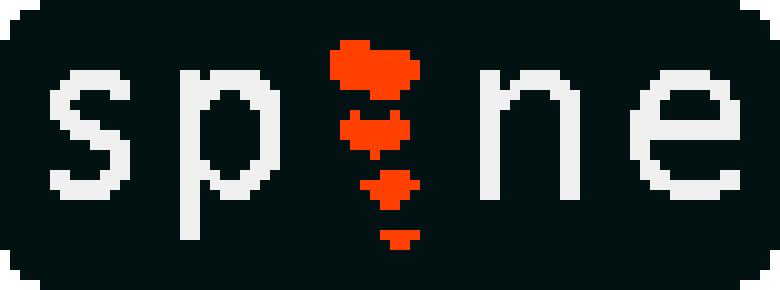
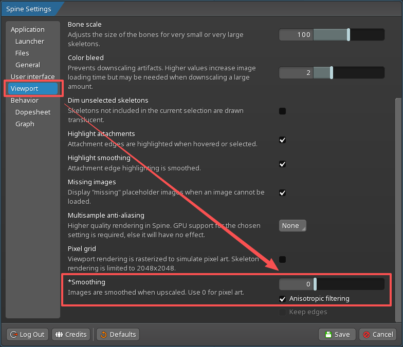
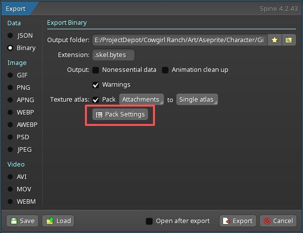
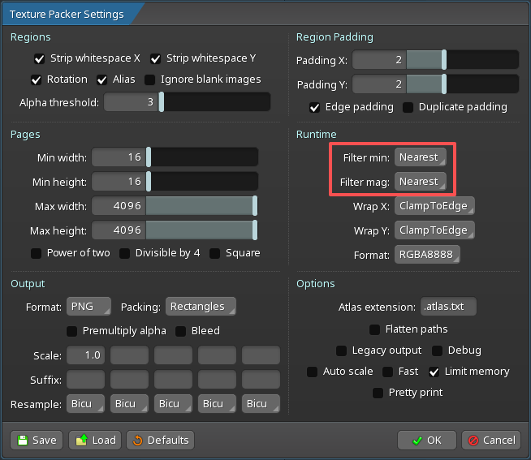

### Update - This has been added to the official Spine Scripts repository

 <https://github.com/EsotericSoftware/spine-scripts>

___

[中文版 文档](README_cn.md)

<div align="center">
  
</div>

# aseprite-to-spine

## Lua Script for importing Aseprite projects into Spine

## v1.3.1

### Installation

1. Open Aseprite
2. Go to **File > Scripts > Open Scripts Folder**
3. Drag the included ```Prepare-For-Spine.lua``` file to this directory
4. In Aseprite, click **File > Scripts > Rescan Scripts Folder**

After following these steps, the "Prepare-For-Spine" script should show up in the list.

### Usage

#### 「Aseprite Export」

1. Create your sprite just like you would in Photoshop.  Each "bone" should be on its own layer.
2. When you're ready to bring your art into Spine, save your project and run the ```Prepare-For-Spine``` script.  You can find it under **File > Scripts > Prepare-For-Spine**.
3. Configure the export options as needed, then click the "Export" button.  By default, the script will export a JSON file and a folder of PNG images to the same directory as your Aseprite project file.
   * The default configuration is suitable for most users, so you can simply click the Export button to use the default settings.
4. If you get a dialogue requesting permissions for the script, click "give full trust" (it's just requesting permission for the export script to save files).


* Reset Config Button: Resets all options to their default values.
  * This will also clear any cached settings, so the next time you open the options dialog it will be restored to the default values.

* Coordinate Settings: Configure the coordinate origin used for exported images in Spine.
  * Origin Mode: Sets how the origin is interpreted, with two modes: Normalized and Pixel.
    * Normalized mode: Origin (X/Y) values are normalized to the [0,1] range.
    * Pixel mode: Origin (X/Y) values represent exact pixel coordinates.
  * [origin] tag import: If a layer name contains [origin], that layer is used as an automatic source for origin coordinates.
    * The center point of that layer is converted to Origin (X, Y) in the export settings.
    * Import success/failure is shown with an icon and status text.
  * Origin (X/Y): Sets the coordinate origin for the exported images.
    * This coordinate origin will align with the coordinate origin in Spine, affecting the default position of the images when imported into Spine.
    * (0,0) represents the bottom-left corner of the image, and (1,1) or (image width, image height) represents the top-right corner.
    * Sliders below the input fields let you quickly adjust X and Y for more intuitive origin placement.
    * There are also quick preset buttons for common origin configurations (Center, Bottom-Center, Bottom-Left, Top-Left) that will automatically set the X and Y values accordingly.
  * Round to Integer: When enabled, the script will round all coordinate values to the nearest integer, dropping any decimal part.
    * This may cause pixel misalignment. For example, if the origin is set to center and the image has odd pixel dimensions, the true center lies at the center of the middle pixel rather than on an edge. Forcing integer coordinates can therefore introduce a half-pixel offset.
    * Pixel art usually requires perfect pixel alignment, so this option is not recommended unless you have a specific need.

* Image Settings: Control export image scale and padding.
  * Scale(%): Adjusts exported image resolution as a percentage. The default is 100%, which means no scaling.
    * Pixel art often appears too small on screen after export; increasing the scale can improve display size.
  * Padding(px): Defines transparent pixel padding around image edges. The default is 1, meaning 1 pixel of edge padding.
    * This can avoid aliasing artifacts for opaque pixels along the image edge.

* Output Settings: Configure output paths for JSON and images, plus export behavior options.
  * Output Path: Allows you to specify a custom output path for the exported JSON file.
    * By default, it will be saved in the same directory as your Aseprite project file.
    * You can type a path directly into the text field, or click the button below to open a file picker dialog. After selecting a location, the path is filled into the text field automatically.
  * Ignore Hidden Layers: When enabled, the script ignores layer visibility during export.
    * Layers are still exported even if the layer itself or its parent group is hidden.
  * Clear Old Images: When enabled, the script will automatically delete any previously exported images in the output directory before exporting new ones.
    * This helps to prevent confusion and clutter from old files that are no longer relevant to the current export.

* Action Buttons: Start export using the current configuration.
  * Export Button: Starts the export process with the configured options.
  * Cancel Button: Closes the options dialog without exporting.

#### 「Spine Import」

1. Open Spine and create a new project.
2. Click the Spine Logo in the top left to open the file menu, and click **[Import Data]**.
3. Set up your Skeleton and start creating animations!


* Import: Import source. Here, use the default selected option: JSON or binary file.
  * JSON or binary file: Import from a JSON file or a binary file.
  * Folder: Import from a folder.
* File: Select the JSON file or folder to import.
  * Click the folder icon button on the right to open the file picker dialog, then choose the JSON file to import or a folder that contains a JSON file.
* Scale: Import scale. The default value is 1.0, which means no scaling.
  * Adjust this value as needed. For example, set it to 0.5 to import assets at half size, or set it to 2.0 to import assets at double size.
* New Project: If checked, a new project will be created during import. Otherwise, imported assets will be added to the currently open project.
  * If you already created an empty new project, you do not need to check this option and can import directly.
* Create a new skeleton: If checked, a new skeleton will be created during import.
  * If you already created an empty new project, you do not need to check this option and can import directly.
* Import into an existing skeleton: If checked, imported assets will be added to an existing skeleton.
  * Replace existing attachments: It is recommended to select this option to ensure that attachments are correctly replaced and coordinates and other related properties are updated.
  * New layers will generate new attachments and be added to the existing skeleton, but the draw order may be incorrect and needs to be manually adjusted in Spine.
* Import button: Start importing with the current configuration.
* Cancel button: Close the dialog and cancel the import.

#### 「Spine Settings」

When creating pixel art, it is usually necessary to turn off smoothing/anti-aliasing to maintain the clarity of the pixel grains.

1. Click the Spine icon in the upper left corner to open the menu and select **[Settings]**.
2. In the Settings window, select **[Viewport]** from the menu on the left.
3. In the Viewport settings on the right, find the **[Smoothing]** option and set the smoothing value to 0.


#### 「Spine Export」

When exporting, images are usually packed into an atlas. To ensure the clarity of pixel art, you need to adjust the export settings for the atlas.

1. Click the Spine icon in the upper left corner to open the menu and select **[Export]**.
2. If you need to pack an atlas, click the **[Pack Settings]** button to open the atlas settings.

3. Set both **[Filter min]** and **[Filter mag]** to **[Nearest]** to ensure the clarity of the pixel grains.


### Known Issues

* Opening the exported file location currently relies on `os` library APIs and may cause a brief UI stall (a few seconds).
* Deleting old `images` files also relies on `os` library APIs and may cause a brief UI stall.
* New layers added in Aseprite may have incorrect draw order when imported into an existing Spine skeleton, and need to be adjusted manually in Spine.

### Version History

#### v1.3.1

* Refine core logic and optimize asset management
  * Replace os.execute shell calls with pure Lua filesystem APIs.
  * Embed Spine logo as RLE data, add regeneration tool.
  * Optimize UI layout and display.
* Fix critical bugs and improve export stability
  * Fix rounding: use math.floor instead of math.modf (truncation).
  * Fix crash when exporting layers with no cels (empty layers).
  * Fix PNG layers warning by flattening cloned sprite before save.
  * Rename config cache extension from .json to .txt (not JSON format).

#### v1.3

* Add coordinate modes and refine layer visibility options
  * Added Normalized [0,1] and Pixel modes for origin coordinates.
  * Added Sliders for Origin (X, Y) to allow more intuitive control.
  * Added "Ignore Hidden Layers" toggle for more flexible exports.
  * Removed redundant "Use layer visibility only" option.

* Add Image Settings for scale and padding control
  * Added Image Scale option to adjust the resolution of exported images.
  * Added Image Padding setting to define pixel padding around image borders.

* Support [origin] layer, add Spine logo, and refine UI layout
  * Layers with [origin] in their name will be automatically configured as the origin coordinates in the export settings.
  * Added Spine Logo to the dialog header for better branding/recognition.
  * Refined UI Layout, Optimized spacing and alignment of all control panels for a cleaner look.

#### v1.2

* Enable Effective Group Visibility During Export
  * Propagated group visibility downward during recursive traversal.
  * Combined layer collection and effective-visibility recording into a single recursive pass to improve efficiency.

* Added a new UI options panel
  * Toggle for Ignore Group Visibility.
  * Export path setting for the output JSON file.

* Added updates to the UI options panel
  * Toggle for Clear Old Images before export.
  * Simplified output path selection workflow.
  * Improved overall UI layout and spacing.

* Added updates to the UI options panel
  * Coordinate origin is now configurable (X/Y), with range support for [0,1].
  * Added a toggle to keep coordinate values as integers (drop decimal part).
  * Added quick access to open the exported file location after export completion.

* Added export workflow and coordinate UI improvements
  * Added origin coordinate preset buttons for quick setup (Center, Bottom-Center, Bottom-Left, Top-Left).
  * Added real-time clamping for origin coordinate inputs, limiting values to the [0,1] range.
  * Added export completion dialog warnings that list any file paths that failed to write during export.

* Added persistent UI configuration cache
  * Added configuration caching for all export options, so settings are restored automatically on next launch.
  * Added a Reset Config button to restore default values and clear cached settings.

#### v1.1

* Changed to export images trimmed to the size of their non-transparent pixels.
* Hidden layers are not included in the json file for importing into Spine.

#### v1.0

Initial Release
