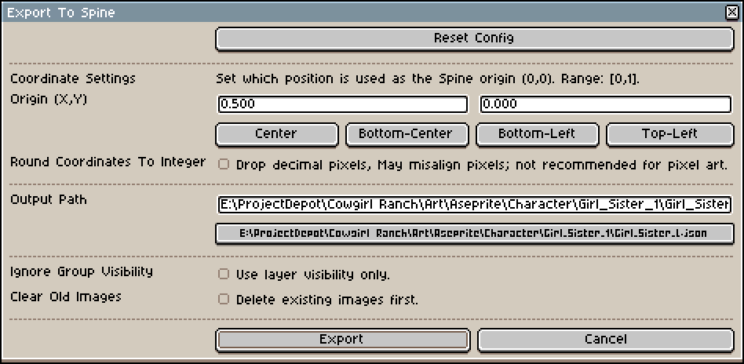

### 更新 - 本脚本已收录到官方 Spine Scripts 仓库

 <https://github.com/EsotericSoftware/spine-scripts>

___

# aseprite-to-spine
[English README](README.md)

## 用于将 Aseprite 项目导入 Spine 的 Lua 脚本

## v1.2

### 安装

1. 打开 Aseprite
2. 进入 **File > Scripts > Open Scripts Folder**
3. 将附带的 ```Prepare-For-Spine.lua``` 文件拖入该目录
4. 在 Aseprite 中点击 **File > Scripts > Rescan Scripts Folder**

完成以上步骤后，你应该能在脚本列表中看到 "Prepare-For-Spine"。

### 使用说明

#### 「Aseprite 导出」

1. 像在 Photoshop 中那样创建你的 精灵。每个 "bone" 建议单独放在一个图层中。
2. 当你准备将美术资源导入 Spine 时，先保存项目，然后运行 ```Prepare-For-Spine``` 脚本。你可以在 **File > Scripts > Prepare-For-Spine** 中找到它。
3. 按需配置导出选项后，点击 "Export" 按钮。默认情况下，脚本会将 JSON 文件和 PNG 图片文件夹导出到 Aseprite 项目文件所在目录。
   * 默认配置 已经适合大多数用户的需求了，所以你可以 直接点击 Export 按钮使用默认配置进行导出。



* Reset Config 按钮：将所有选项 重置为 默认值。
  * 同时会 清除缓存设置，因此下次 打开选项弹窗时会 恢复默认配置。
* Origin (X/Y)：设置导出图像在 Spine 中使用的 坐标原点。
  * 这个 坐标原点 会与 Spine中的坐标原点 对齐，影响导入后图片在Spine中的 默认位置。
  * 原点坐标 被规范化到 [0,1] 区间，其中 (0,0) 表示图像 左下角，(1,1) 表示图像 右上角。
  * 提供了 常用原点的 预设按钮（Center、Bottom-Center、Bottom-Left、Top-Left），点击后会 自动设置对应的 X、Y 值。
* Round Coordinates to Integer：启用后，脚本会将所有 坐标值取整，丢弃小数部分。
  * 这可能导致 像素不对齐。例如，将原点设为中心 且 图片像素尺寸为奇数时，几何中心会落在 中间像素中心 而不是边界上，强制整数坐标 可能带来 半像素偏移。
  * 像素风格 通常需要严格的 像素对齐，除非有特殊需求，否则不建议开启该选项。
* Output Path：允许你为导出的 JSON 文件 指定自定义输出路径。
  * 默认会保存到 Aseprite 项目文件所在目录。
  * 你可以直接在 文本框中输入路径，或者点击 下方按钮 打开文件选择对话框。选择后，路径会 自动填入文本框。
* Ignore Group Visibility：启用后，导出时将 忽略组可见性。
  * 仅根据 图层自身可见性判断，不考虑其 父组是否可见。这意味着即使 组被隐藏，只要图层本身可见，仍会被导出。
* Clear Old Images：启用后，导出前会 自动删除 输出目录中旧的图片。
  * 这可以减少 旧文件残留 造成的 混淆和目录杂乱。
* Export 按钮：使用当前配置 开始导出。
  * 导出完成后，可点击 [Open File Folder] 按钮直接 打开导出目录。
* Cancel 按钮：关闭选项弹窗并 取消导出。

如果脚本 请求权限，请点击 "give full trust"（脚本仅需要文件写入权限以完成导出）。

#### 「Spine 导入」

1. 打开 Spine 并新建项目。
2. 点击左上角 Spine 图标打开文件菜单，然后点击 **Import Data**。
3. 配置 Skeleton 并开始制作动画。

### 已知问题

#### v1.2

* 打开 导出文件位置，目前依赖 `os` 库 API，可能导致短暂 UI 卡顿（几秒）。
* 删除旧的 `images` 文件，同样依赖 `os` 库 API，也可能导致短暂 UI 卡顿。

#### v1.1

* 隐藏图层组 不会阻止 组内图层导出。每个图层都需要 单独设置显示/隐藏（组可见性会被忽略）。
* 选项数量相比 Photoshop 脚本更少。后续可能会补充，但作者目前很少用到这些选项。

### 版本历史

#### v1.2

* 导出时启用组可见性的有效继承
  * 在递归遍历中将组可见性向下传递。
  * 将图层收集与有效可见性记录合并为一次递归遍历，以提升效率。

* 新增 UI 选项面板
  * 增加 Ignore Group Visibility 开关。
  * 增加 JSON 输出路径设置。

* UI 选项面板更新
  * 增加导出前清理旧图片（Clear Old Images）开关。
  * 简化输出路径选择流程。
  * 优化整体 UI 布局与间距。

* UI 选项面板更新
  * 支持配置坐标原点（X/Y），范围为 [0,1]。
  * 增加坐标取整开关（丢弃小数部分）。
  * 导出完成后可快速打开导出文件位置。

* 导出流程与坐标配置改进
  * 增加原点坐标预设按钮（Center、Bottom-Center、Bottom-Left、Top-Left）。
  * 增加原点坐标输入实时范围限制，自动约束到 [0,1]。
  * 导出完成弹窗支持列出写入失败的文件路径。

* 增加 UI 配置持久化缓存
  * 缓存所有导出选项，下次启动自动恢复。
  * 增加 Reset Config 按钮，可恢复默认值并清除缓存。

#### v1.1

* 导出的图片会自动裁剪到非透明像素区域大小。
* 隐藏图层不会被写入用于导入 Spine 的 JSON 文件。

#### v1.0

初始发布
