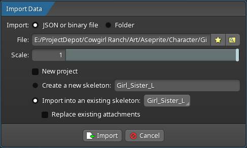

### 更新 - 本脚本已收录到官方 Spine Scripts 仓库

 <https://github.com/EsotericSoftware/spine-scripts>

___

[English README](README.md)

# aseprite-to-spine

## 用于将 Aseprite 项目导入 Spine 的 Lua 脚本

## v1.3

### 安装

1. 打开 Aseprite
2. 进入 **File > Scripts > Open Scripts Folder**
3. 将附带的 ```Prepare-For-Spine.lua``` 文件拖入该目录
4. 在 Aseprite 中点击 **File > Scripts > Rescan Scripts Folder**

完成以上步骤后，你应该能在脚本列表中看到 "Prepare-For-Spine"。

### 使用说明

#### 「Aseprite 导出」

1. 像在 Photoshop 中那样创建你的 精灵。每个 "bone" 建议单独放在一个图层中。
2. 当你准备将美术资源导入 Spine 时，先保存项目，然后运行 ```Prepare-For-Spine``` 脚本。你可以在 **File > Scripts > Prepare-For-Spine** 中找到它。
3. 按需配置导出选项后，点击 "Export" 按钮。默认情况下，脚本会将 JSON 文件和 PNG 图片文件夹导出到 Aseprite 项目文件所在目录。
   * 默认配置 已经适合大多数用户的需求了，所以你可以 直接点击 Export 按钮使用默认配置进行导出。
4. 如果脚本 请求权限，请点击 "give full trust"（脚本仅需要文件写入权限以完成导出）。


* Reset Config 按钮：将所有选项 重置为 默认值。
  * 同时会 清除缓存设置，因此下次 打开选项弹窗时会 恢复默认配置。

* Coordinate Settings：坐标配置。设置导出图像在 Spine 中的坐标原点。
  * [origin]标签导入：如果图层名称中包含 [origin]，该图层会被用作 原点坐标 的自动配置来源。
    * 该图层的 中心点坐标 会被转换为 导出设置中的 Origin (X, Y)。
    * 是否成功导入，会通过图标与文本进行提示。
  * Origin Mode：设置坐标原点的模式，支持 Normalized（归一化）和 Pixel（像素）两种模式。
    * Normalized 模式：Origin (X/Y) 的值被 规范化到 [0,1] 区间。
    * Pixel 模式：Origin (X/Y) 的值表示具体的 像素坐标。
  * Origin (X/Y)：设置导出图像在 Spine 中使用的 坐标原点。
    * 这个 坐标原点 会与 Spine中的坐标原点 对齐，影响导入后图片在Spine中的 默认位置。
    * (0,0) 表示图像的左下角，(1,1) 或 (图像宽度, 图像高度) 表示图像的右上角。
    * 输入框底部的 滑块，可以快速调整 X 和 Y 的值，更直观地设置 坐标原点位置。
    * 提供了 常用原点的 预设按钮（Center、Bottom-Center、Bottom-Left、Top-Left），点击后会 自动设置对应的 X、Y 值。
  * Round to Integer：启用后，脚本会将所有 坐标值取整，丢弃小数部分。
    * 这可能导致 像素不对齐。例如，将原点设为中心 且 图片像素尺寸为奇数时，几何中心会落在 中间像素中心 而不是边界上，强制整数坐标 可能带来 半像素偏移。
    * 像素风格 通常需要严格的 像素对齐，除非有特殊需求，否则不建议开启该选项。

* Image Settings：控制导出图像的 缩放与边距。
  * Scale(%)：调整导出 图像分辨率的 缩放比例 的百分比。默认值为 100%，表示不缩放。
    * 像素艺术在导出后，通常会有 在屏幕上显示的尺寸过小 的问题，可以通过增加 缩放比例 来放大显示的尺寸。
  * Padding(px)：定义图像边缘的 像素留白。默认值为 1，表示在 图像边缘 留出1像素的空白区域。
    * 对于 不透明像素 沿图像边缘的 锯齿伪影，增加边距 可以起到 缓解作用。

* Output Settings：输出配置。Json文件 与 图片 的输出路径 与 各类导出选项。
  * Output Path：允许你为导出的 JSON文件 指定自定义 输出路径。
    * 默认会保存到 Aseprite 项目文件 所在目录。
    * 你可以直接在 文本框中 输入路径，或者点击 下方按钮 打开文件选择对话框。选择后，路径会 自动填入文本框。
  * Ignore Hidden Layers：启用后，脚本会在导出时 忽略图层的可见性。
    * 即使 图层 或其父组被隐藏，仍然会被导出。
  * Clear Old Images：启用后，导出前会 自动删除 输出目录中旧的图片。
    * 这可以减少 旧文件残留 造成的 混淆和目录杂乱。

* 执行按钮： 使用当前配置 开始导出。
  * Export 按钮：使用当前配置 开始导出。
    * 导出完成后，可点击 [Open File Folder] 按钮直接 打开导出目录。
  * Cancel 按钮：关闭选项弹窗并 取消导出。

#### 「Spine 导入」

1. 打开 Spine 并新建项目。
2. 点击左上角 Spine 图标打开文件菜单，然后点击 **[Import Data]**。
3. 配置 Skeleton 并开始制作动画。



* Import：导入来源。这里使用 默认选择的 JSON or binary file。
  * JSON or binary file：从 JSON 或二进制文件导入。
  * Folder：从文件夹导入。
* File：选择要导入的 JSON 文件或文件夹。
  * 点击右侧的 “文件夹”图标按钮，可以打开 文件选择对话框，选择要导入的 JSON 文件或包含 JSON 文件的文件夹。
* Scale：导入时的缩放比例。默认值为 1.0，表示不缩放。
  * 可以根据需要 调整该值，例如设置为 0.5 将导入资源 缩小一半，设置为 2.0 将导入资源 放大两倍。
* New Project：如果选中，导入时会 创建一个新项目。否则，导入的资源会被添加到 当前打开的项目中。
  * 如果已经创建了 空的新项目，则不需要选中该选项，直接导入即可。
* Create a new skeleton：如果选中，导入时会 创建一个新的骨架。
  * 如果已经创建了 空的新项目，则不需要选中该选项，直接导入即可。
* Import into an existing skeleton：如果选中，导入的资源会被添加到 现有骨架中。
  * Replace existing attachments：建议选中，以确保 附件被正确替换，更新 坐标和其他相关属性。
  * 新增的图层 会生成 新的附件 并添加到 现有的骨架中，但是 绘制顺序 可能会出现问题，需要在 Spine 中手动调整。
* Import 按钮：使用当前配置 开始导入。
* Cancel 按钮：关闭对话框并 取消导入。

### 已知问题

* 打开 导出文件位置，目前依赖 `os` 库 API，可能导致短暂 UI 卡顿（几秒）。
* 删除旧的 `images` 文件，同样依赖 `os` 库 API，也可能导致短暂 UI 卡顿。
* Aseprite 中新增的图层，在导入到 Spine 的现有骨架时，可能会出现 绘制顺序不正确 的问题，需要在 Spine 中手动调整。

### 版本历史

#### v1.3

* 新增 坐标模式 并 优化图层可见性选项
  * 为原点坐标 新增 Normalized 与 Pixel 两种模式。
  * 为 Origin (X, Y) 新增滑杆，便于 更直观地调整。
  * 新增 "Ignore Hidden Layers" 开关，让导出更灵活。
  * 移除冗余的 "Use layer visibility only" 选项。

* 新增 Image Settings，用于控制 缩放与边距
  * 新增 Image Scale 选项，用于调整 导出图像分辨率的 缩放比例。
  * 新增 Image Padding 设置，用于定义 图像边缘的 像素留白。

* 支持 [origin] 图层、添加 Spine logo，并优化 UI 布局
  * 图层名称 中包含[origin]的图层，会被作为 原点坐标 自动配置到 导出设置。
  * 在对话框头部 新增 Spine Logo，提升识别度。
  * 优化 UI 布局，调整各控制面板的 间距与对齐，使界面更整洁。

#### v1.2

* 导出时启用组可见性的有效继承
  * 在递归遍历中 将组可见性 向下传递。
  * 将 图层收集 与 有效可见性记录 合并为一次递归遍历，以提升效率。

* 新增 UI 选项面板
  * 增加 Ignore Group Visibility 开关。
  * 增加 JSON 输出路径设置。

* UI 选项面板更新
  * 增加导出前 清理旧图片（Clear Old Images）开关。
  * 简化 输出路径选择流程。
  * 优化整体 UI 布局与间距。

* UI 选项面板更新
  * 支持配置 坐标原点（X/Y），范围为 [0,1]。
  * 增加 坐标取整 开关（丢弃小数部分）。
  * 导出完成后 可快速打开 导出文件位置。

* 导出流程与坐标配置改进
  * 增加 原点坐标预设按钮（Center、Bottom-Center、Bottom-Left、Top-Left）。
  * 增加 原点坐标输入 实时范围限制，自动约束到 [0,1]。
  * 导出完成弹窗 支持列出 写入失败的文件路径。

* 增加 UI 配置持久化缓存
  * 缓存所有 导出选项，下次启动 自动恢复。
  * 增加 Reset Config 按钮，可恢复默认值 并清除缓存。

#### v1.1

* 导出的图片会 自动裁剪 到非透明像素区域大小。
* 隐藏图层 不会被写入用于导入 Spine 的 JSON 文件。

#### v1.0

初始发布
