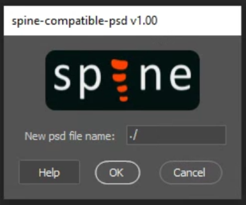

# Spine Compatible PSD

Spine allows you to directly import Adobe Photoshop files. However, some Photoshop features, such as adjustment layers and layer effects, are not supported. If you use an unsupported Photoshop feature on a layer, you can do one of the following:

- Transform the unsupported layers into smart objects. Photoshop will save a rasterized version of the resulting layer into the PSD file, and Spine will be able to import it without any additional effort.
- Use this script to generate a compatible PSD file for Spine.
- Continue using the [PhotoshopToSpine](../) script.

This script saves a copy of an Adobe Photoshop file fully compatible with the Import PSD functionality of Spine.
It applies all adjustment layers, clipping masks, and layer effects.
It supports the latest version of Photoshop CC and all older versions of Photoshop back to CS2.

## Download

To download the script, left click this link: [SpineCompatiblePsd.jsx](https://esotericsoftware.com/spine-scripts/SpineCompatiblePsd.jsx) (do not right click and "save as", do not click a different link above). Make sure the extension of the file you are saving is `.jsx`. If you use the link in the list of files above, you may mistakenly save a web page.

To see the Spine logo on the dialog, you may optionally click [logo.png](https://esotericsoftware.com/spine-scripts/logo.png) and save the logo image in the same folder as the script file.

## Install

Navigate to the Photoshop installation folder, then choose the folder `Presets`, then `Scripts`. On Windows the path is likely similar to this:
```
C:\Program Files\Adobe\Adobe Photoshop CC 2019\Presets\Scripts
```

Copy the files `SpineCompatiblePsd.jsx` (and optionally `logo.png`) inside the `Scripts` folder, then restart Photoshop.

## Usage

The script can be run by choosing `File` > `Scripts` > `SpineCompatiblePsd` in Photoshop.

If you didn't copy the files in the Photoshop directory, the script can also be run by choosing `File` > `Scripts` > `Browse` in Photoshop.

The script can also be run by dragging the file to Photoshop window's menu bar or toolbar if you're using Photoshop v19 or earlier.

It can be helpful to create a Photoshop action that runs the script. A function key can be specified for the action, allowing the script to be run with a single key press.



Fill in the `New psd file name` text field. If the name ends in `.psd`, that will be the name of the PSD file that is created. Otherwise, the script will create the file in the specified folder, using the original PSD file name and adding the suffix `-spineCompatible`.

Once you are ready, click the `OK` button. This will start the process to generate the compatible PSD file.

Every time you make a modification to your original file, you need to run the script again to reflect the changes to the compatible PSD file.

## Debugging

Follow the instructions you find in the [readme of PhotoshopToSpine](../README.md#debugging).
