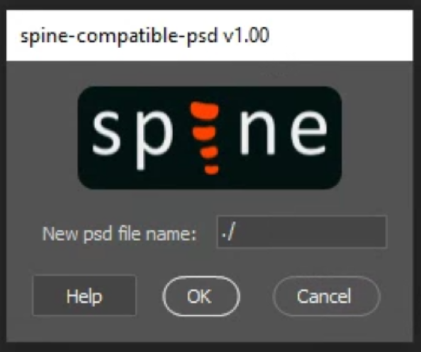

# Spine Compatible PSD

This script saves a copy of an Adobe Photoshop file compatible with the Import PSD functionality of Spine.
It applies all adjustment layers, clipping masks, and layer effects.
It supports the latest version of Photoshop CC and all older versions of Photoshop back to CS2.

## Download

To download the script, click [this link](https://github.com/EsotericSoftware/spine-scripts/blob/master/photoshop/PhotoshopToSpine.jsx), then click the `Download raw file` button. Make sure the extension of the file you are saving is `.jsx`.

## Install

Follow the same instructions you find in the [readme of PhotoshopToSpine](../README.md#install).

## Usage

To start the script, follow the instructions you find in the Usage section of the [readme of PhotoshopToSpine](../README.md#usage)., but use `spine-compatible-psd` instead. 

* `New psd file name` If ending in `.psd`, the PSD file that will be written. Otherwise, the folder where the PSD file will be written, using the name of the PSD file and adding the suffix `-spineCompatible` to the original name.

## Debugging

Follow the same instructions you find in the [readme of PhotoshopToSpine](../README.md#debugging).
